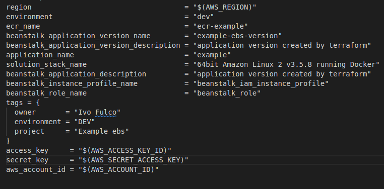

[[_TOC_]]

# Overview

The image has the visual representation from Terraform Graph

# Stacks

## Azure DevOps

The file `azure-pipelines.yml` contains the steps for the Azure pipeline to deploy environment on AWS Cloud.

## AWS CLI

You can install [aws cli](https://aws.amazon.com/pt/cli/) manually or execute Makefile.

In main folder you can execute the command below to install application:

`make install-aws-cli`

## Terraform

Terraform is IaC to provision and manage your infrastructure on AWS Cloud, the S3 bucket will be store your tfstate file

You can install [terraform cli](https://developer.hashicorp.com/terraform/tutorials/aws-get-started/install-cli) manually or execute Makefile.

In main folder you can execute the command below to install application:

`make install-terraform`

## Terraform Graph

In main folder you can execute the command below to install application:

`make install-graphviz`

- For generate graph about your infrastructure run the command: `terraform graph | dot -Tsvg > graph.svg`

---

# Pre-requisites

- S3 Bucket to store terraform tfstate
- Service account to access key and secret key

# Naming convention

{{teamName}} – {{environment}} – {{scope}} – {{resource}}

# Improvement points

- Autoscaling
- IAM scope security
- New environments

# Variables values

Include on .gitignore has inserted `terraform.tfvars` the file content explain how values need to create your infrastructure, the content looks like as image below:

---

---

## Use cases:

1º Method:
- You need create a file terraform.tfvars when execute your script with content similiar to the image above 

2º Method:
- You can execute a [Azure DevOps pípeline](#azure-devops)

3º Method
- Rename  file ´terraform.tfvars.placeholder´ and change some values

# Terraform execution

To give more velocity during deploy process you can execute a Makefile command, like:

`make tf-apply`

## Terraform tfstate

The state of environments it's on s3 configured on file `backend.tf`

## Azure DevOps

The tool used for deploy the infrastructure is Azure Pipelines, we can see the steps on the file 'azure-pipelines.yml'

## Pipeline Requisites

- Library: with secret for the service account
- Azure DevOps conventional permission and license Basic